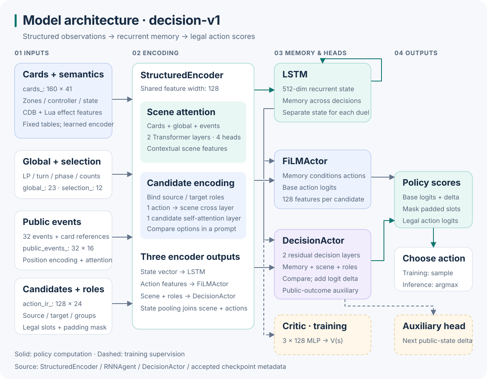
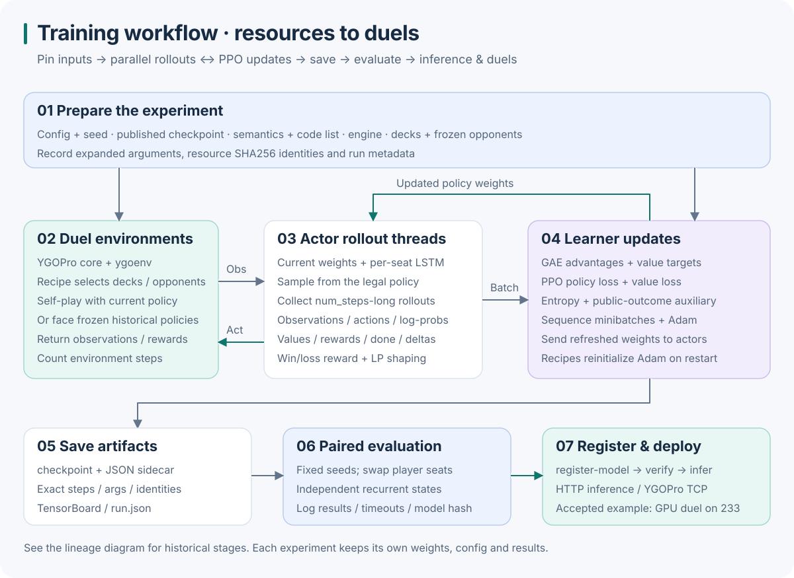
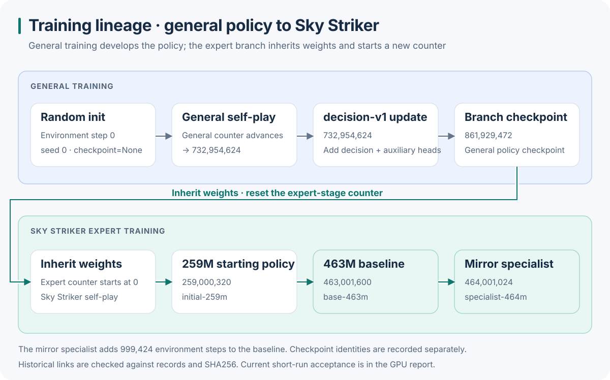

# Model architecture and training workflow

[Home](../README.en.md) · [中文](模型结构与训练流程.md) · [Training recipes (Chinese)](训练与验证.md) · [Historical lineage (Chinese)](历史训练沿革.md)

Start with a single decision, then follow the learning loop and the historical training stages. The architecture follows the implementation and accepted checkpoint metadata; the lineage follows archived records and checkpoint identities.

## How the policy chooses an action



### Structured observations

Card identifiers index frozen CDB attributes and Lua effect features. Learned semantic encoders combine those features with the card's zone, controller and dynamic state. The tables stay fixed while the encoding network learns.

| Input | Shape, excluding batch | Contents |
| --- | --- | --- |
| `cards_` | `160 × 41` | Card identifiers, zones, controllers and dynamic state |
| `global_` | `23` | LP, turn, phase and public counts |
| `selection_` | `12` | Current prompt, role and numeric constraints |
| `public_events_` | `32 × 16` | Recent public decision events |
| `public_event_refs_` | `32 × 4` | Cards referenced by each event |
| `action_ir_` | `128 × 24` | Structured candidate action descriptions |
| `action_single_refs_` | `128 × 4` | Single-card action roles |
| `action_group_refs_` / `action_group_mask_` | `128 × 5 × 8` | Role-specific card groups and valid entries |

There are 128 candidate slots; the number of legal actions varies with the prompt. The shared input contract also carries `actions_` and `h_actions_`. The diagram follows the branches read by `StructuredEncoder`, whose event history comes from `public_events_`.

### Scene and candidate encoding

The encoder uses **128-dimensional features** and **4 attention heads**. Two scene Transformer layers contextualize cards, global state and position-encoded events. Candidate actions bind source, target and group roles, attend to the scene through one cross-attention layer, then compare options through one candidate self-attention layer. State pooling combines scene, global and candidate summaries.

### Memory and policy heads

A **512-dimensional LSTM** carries memory across decisions. Training and evaluation keep separate states for each seat. Serving keeps a state per session and resets it for a new duel.

**FiLMActor** conditions candidate features on recurrent memory and produces base logits. **DecisionActor** uses two residual decision layers to combine memory, scene and action roles, compare candidates and produce a correction:

```text
candidate logit = FiLMActor base logit + DecisionActor residual
```

The policy masks padded slots. Training samples from the legal action distribution; the published inference path chooses `argmax`.

### Training supervision

The critic passes recurrent features through three 128-dimensional hidden layers and outputs `V(s)` for value targets and advantages.

The decision branch also predicts changes in both players' LP and public zone counts at the next engine decision. The executed action is supervised with delta regression and decrease / unchanged / increase classification. Validity masks handle terminal and reset boundaries. The next decision may occur during chain processing. Published recipes set the auxiliary coefficient to `0.05`.

## How a training run works



1. Pin the starting checkpoint, semantics, code list, native engine, decks and seed. Prepare frozen opponents for recipes that use a historical pool.
2. Actors sample legal actions and collect observations, actions, log-probabilities, values, rewards, done flags and public-outcome targets.
3. The learner calculates GAE advantages and value targets, updates sequence minibatches with PPO and sends refreshed weights to actors.
4. Save checkpoints, sidecars, exact step counts, resource identities, `run.json`, TensorBoard logs and deck statistics.
5. Evaluate with fixed seeds and paired seat swaps. Register the resulting model to use it for inference, HTTP serving or TCP duels.

The configured loss combines these terms:

```text
loss = PPO policy loss + value coefficient × value loss
     − entropy coefficient × policy entropy
     + auxiliary coefficient × public-outcome prediction loss
```

Duel results provide rewards; recipes also apply LP shaping. Current continuation recipes restore model variables and initialize a fresh Adam state. Historical stages retain their recorded optimizer restart boundaries.

`total_timesteps` specifies additional environment steps. Each rollout batch contains `local_num_envs × num_actor_threads × num_steps × actor_device_count` steps. Cumulative progress adds those steps to the starting checkpoint's counter. See [the recipe guide](训练与验证.md) for commands and opponent pools.

## From random initialization to the expert policies



General training started from random initialization. The policy migrated to `decision-v1` at **732,954,624** general environment steps and added the residual decision and public-outcome heads. The Sky Striker branch inherited the **861,929,472**-step general checkpoint and started its own expert counter at zero.

| Published model | Expert environment steps | Role |
| --- | ---: | --- |
| `initial-259m` | 259,000,320 | Public continuation starting point |
| `base-463m` | 463,001,600 | Sky Striker baseline |
| `specialist-464m` | 464,001,024 | Mirror specialist with 999,424 additional steps |

The arrows describe historical weight relationships. Archived logs, sources, decks and checkpoint identities have been checked; stage replay status is recorded in [historical training](随机初始化历史训练.md). The current integrated entry point passed five GPU recipe smoke runs and 32 paired evaluations, totaling 64 games; see [the GPU acceptance report](全新GPU复现报告.md).

## Source map

| Diagram component | Implementation or evidence |
| --- | --- |
| Observation shapes | [observation.py](../src/ygo_sky/observation.py) |
| Semantics, scene and candidate encoding | [structured_agent.py](../src/ygoai/rl/jax/structured_agent.py) |
| LSTM, FiLMActor, critic and logit composition | [agent.py](../src/ygoai/rl/jax/agent.py) |
| Decision residual, outcome targets and loss | [decision.py](../src/ygoai/rl/jax/decision.py) |
| Rollouts, GAE and PPO | [cleanba.py](../src/ygo_sky/training/cleanba.py), [recipes](../configs/train) |
| Accepted model arguments | [GPU report metadata](全新GPU复现数据.json), [historical sidecar](../third_party/legacy-lineage/records/corrected/20260920_259000320_steps.flax_model.json) |
| Historical stages | [training-lineage.json](training-lineage.json), [resource contract](模型与资源契约.md) |

## Edit and regenerate the diagrams

The six diagrams are SVGs with text titles and descriptions, linked from both READMEs with descriptive alternative text. They render directly on GitHub and remain sharp when enlarged.

The generator uses the Python standard library. It reads accepted model arguments and checks them against the archived sidecar, reads tensor shapes from the observation contract, and reads checkpoint steps from the model manifests:

```bash
python scripts/render_diagrams.py
```

Commit the [generator](../scripts/render_diagrams.py) together with the generated [SVG assets](images).
