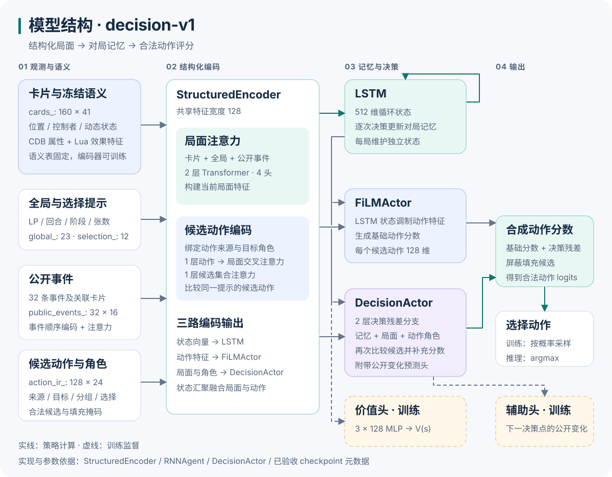
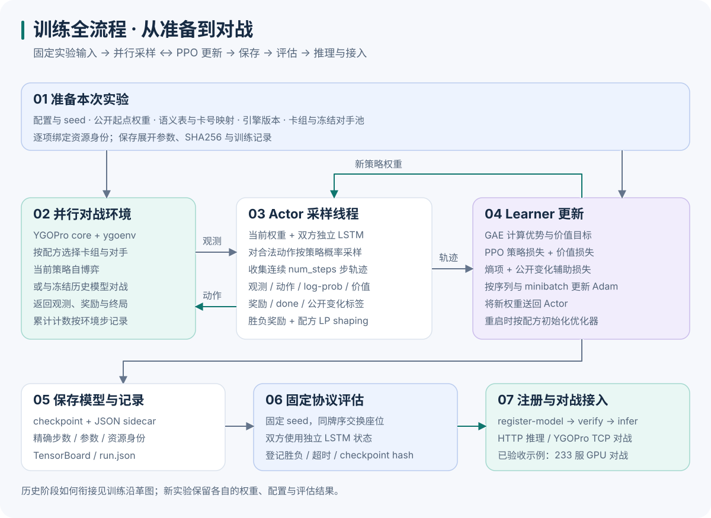
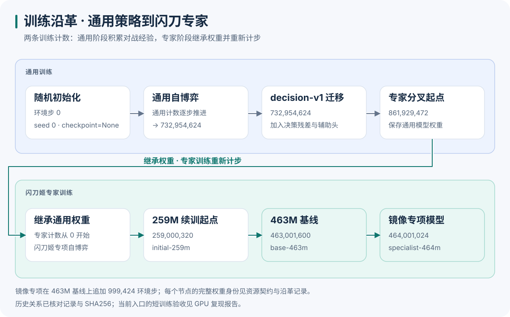

# 模型结构与训练流程

[返回首页](../README.md) · [English](model-and-training.md) · [训练与验证](训练与验证.md) · [历史训练沿革](历史训练沿革.md)

这篇文档从一次动作选择讲起，再看训练循环，最后把各个历史阶段接起来。结构图依据实际模型实现与已验收 checkpoint 元数据绘制，阶段图依据归档的训练记录与权重身份绘制。

## 模型如何选择动作



### 1. 用结构化特征描述局面

输入包括卡片状态、全局信息、公开事件，以及引擎提供的候选动作。卡号用来查询固定的 CDB 属性和 Lua 效果特征；这些特征与当前位置、控制者、攻守等动态状态一起编码成卡片向量。

冻结的是语义表，读取这些语义的编码网络仍参与训练。模型据此把卡片、当前局面和候选动作放在同一特征空间中。

| 输入 | 形状，省略 batch 轴 | 表达的内容 |
| --- | --- | --- |
| `cards_` | `160 × 41` | 卡号、区域、控制者与动态状态 |
| `global_` | `23` | LP、回合、阶段与公开张数 |
| `selection_` | `12` | 当前选择提示、角色与数值约束 |
| `public_events_` | `32 × 16` | 最近的公开决策事件 |
| `public_event_refs_` | `32 × 4` | 事件关联的卡片引用 |
| `action_ir_` | `128 × 24` | 候选动作的结构化描述 |
| `action_single_refs_` | `128 × 4` | 候选动作关联的单卡角色 |
| `action_group_refs_` / `action_group_mask_` | `128 × 5 × 8` | 按角色分组的卡片集合与有效位置 |

`128` 是候选动作槽位数，每次提示的有效动作数量随局面变化。输入契约还保留 `actions_` 和 `h_actions_` 以兼容共享接口；图中展示的是 `StructuredEncoder` 实际读取的分支，事件历史来自 `public_events_`。

### 2. 同时理解局面与候选动作

`StructuredEncoder` 的特征宽度为 **128**，注意力使用 **4 个头**：

- **局面分支**：全局状态、卡片和经过顺序编码的事件拼成序列，经过 2 层 Transformer 局面注意力。
- **动作分支**：绑定来源、目标和分组角色，经过 1 层动作到局面的交叉注意力、1 层候选集合注意力。
- **状态汇聚**：结合局面摘要、全局状态和候选动作汇聚特征，输出供 LSTM 使用的状态向量。

模型由此得到每个动作的特征、整个局面的状态向量，以及供决策分支读取的局面和角色上下文。

### 3. 保留对局记忆并比较动作

**512 维 LSTM**在每次决策时更新记忆。训练和评估按双方座位维护各自的状态；HTTP 和对战推理按会话保存状态，在新一局开始时重置。

策略的两个分支共同评分：

- **FiLMActor** 用 LSTM 状态调制动作特征，输出基础分数。
- **DecisionActor** 使用 2 层决策残差分支，结合记忆、局面和动作角色，再比较候选并输出分数增量。

```text
候选动作分数 = FiLMActor 基础分数 + DecisionActor 决策残差
```

合成后按真实候选掩码屏蔽填充槽位。训练时从合法动作分布采样；公开推理入口使用 `argmax` 选择动作。

### 4. 训练还需要两类监督

**价值头**将 LSTM 状态送入 3 个 128 维隐藏层的 MLP，输出标量 `V(s)`，用于计算价值目标与优势。

**公开变化辅助头**与决策分支共享特征，预测双方 LP 和区域公开张数从当前决策点到下一决策点的变化。监督取自实际执行动作后的观测，包含变化值回归和下降 / 不变 / 上升分类。有效性掩码会处理终局与重置边界。

这个标签描述下一次引擎决策时的公开状态变化；该时间点可能位于连锁处理中。辅助系数在公开配方中为 `0.05`。

## 一次训练如何跑通



1. **准备实验**：指定公开起点权重、卡组、语义表、卡号映射、原生环境和 seed；使用历史对手的配方还需准备冻结对手池。
2. **采样对局**：Actor 用当前策略与独立 LSTM 状态驱动环境，记录观测、动作、策略概率、价值、奖励、终局标记和公开变化标签。
3. **计算目标并更新**：Learner 从 rollout 计算 GAE 优势和价值目标，再按序列 minibatch 执行 PPO 更新，回传新权重给 Actor。
4. **保存实验产物**：checkpoint 与 sidecar 记录精确步数、结构参数和资源身份；`run.json`、TensorBoard 与卡组统计保留训练过程。
5. **评估与使用**：固定 seed 和牌序，交换双方座位做成对评估；登记新模型后，用同一权重执行推理、HTTP 服务或 TCP 对战。

当前配方使用的总损失由以下部分组成，各项系数来自训练配置：

```text
总损失 = PPO 策略损失
       + 价值系数 × 价值损失
       − 熵系数 × 策略熵
       + 辅助系数 × 公开变化预测损失
```

对局胜负提供奖励，配方另加入 LP shaping。当前续训入口恢复模型变量，并初始化新的 Adam 状态；历史阶段也保留相应的优化器重启边界。

本次追加步数由配置的 `total_timesteps` 指定。每个 rollout batch 的环境步数为：

```text
local_num_envs × num_actor_threads × num_steps × actor_device 数量
```

累计步数由起点加上本次追加步数得出。具体运行命令、对手池准备和评估配置见[训练与验证](训练与验证.md)。

## 从随机初始化到闪刀专家



通用策略从随机初始化开始，在 **732,954,624** 步迁移为 `decision-v1`，增加决策残差与公开变化辅助头。在 **861,929,472** 步保存的通用权重随后用于闪刀专家分叉；专家阶段从 0 开始记录专项训练步数。

| 公开模型 | 专家累计环境步 | 角色 |
| --- | ---: | --- |
| `initial-259m` | 259,000,320 | 公开续训起点 |
| `base-463m` | 463,001,600 | 闪刀姬专家基线 |
| `specialist-464m` | 464,001,024 | 基线上追加 999,424 步的镜像专项 |

阶段图展示历史实验之间的权重关系。原始阶段的日志、源码、卡组与 checkpoint 身份已归档核对；各阶段复跑进度见[随机初始化历史训练](随机初始化历史训练.md)。当前整合入口的五份配方已经完成 GPU 短训练，随后完成 32 个 pair、共 64 局评估，详见[GPU 复现报告](全新GPU复现报告.md)。

## 图与源码如何对应

| 图中模块 | 对应源码或记录 |
| --- | --- |
| 输入字段与张量形状 | [observation.py](../src/ygo_sky/observation.py) |
| 冻结语义、局面编码、候选角色与注意力 | [structured_agent.py](../src/ygoai/rl/jax/structured_agent.py) |
| LSTM、FiLMActor、价值头与分数合成 | [agent.py](../src/ygoai/rl/jax/agent.py) |
| 决策残差、公开变化标签与辅助损失 | [decision.py](../src/ygoai/rl/jax/decision.py) |
| Actor / Learner、GAE、PPO 与 checkpoint | [cleanba.py](../src/ygo_sky/training/cleanba.py)、[训练配方](../configs/train) |
| 实际模型结构参数 | [已验收 checkpoint 元数据](全新GPU复现数据.json)、[历史 259M sidecar](../third_party/legacy-lineage/records/corrected/20260920_259000320_steps.flax_model.json) |
| 历史阶段与权重身份 | [training-lineage.json](training-lineage.json)、[资源契约](模型与资源契约.md) |

## 编辑与重新生成图

六张中英文图均为 SVG，GitHub 可以直接显示，放大后文字和箭头保持清晰。标题、说明和 Markdown 替代文字为文本阅读提供入口。

图的生成脚本使用 Python 标准库，按已验收元数据读取结构参数，并核对历史 sidecar；输入形状读取自观测契约，公开模型步数读取自配置清单。更新图时执行：

```bash
python scripts/render_diagrams.py
```

图源见 [render_diagrams.py](../scripts/render_diagrams.py)，生成文件在 [images](images)。提交时一起更新图源和 SVG。
